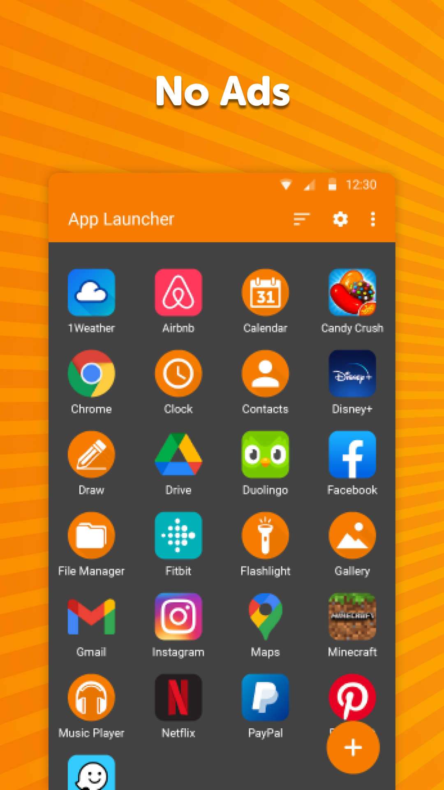
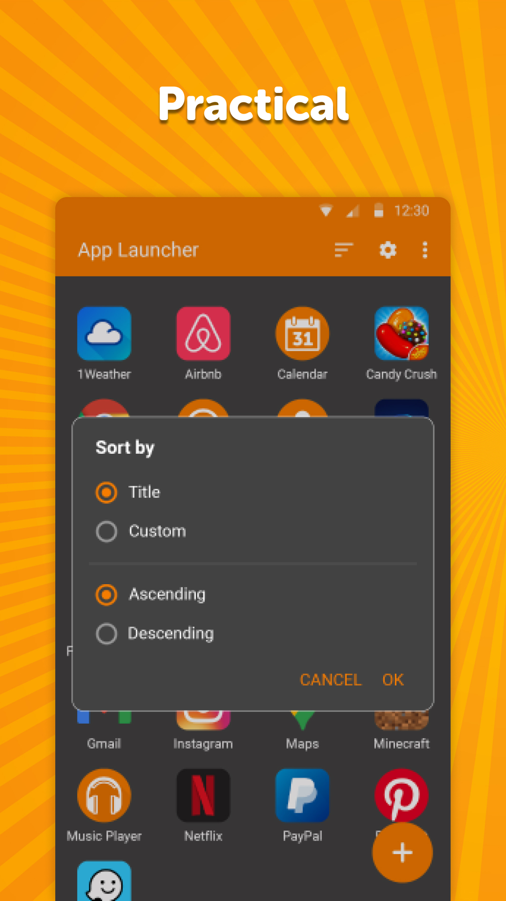
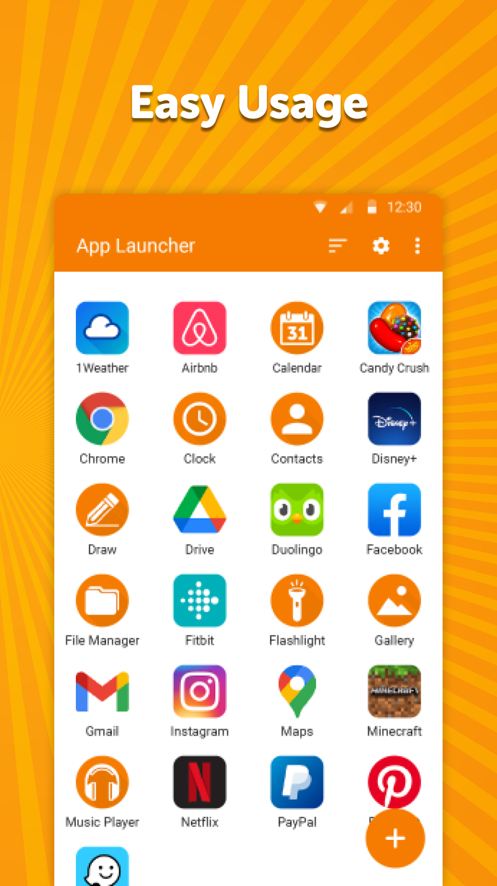

# Simple App Launcher

This is not a real launcher, just a wrapper for your favorite app icons for quick launching. You can easily add any app launcher, so you won\'t ever again have to swipe through useless apps to find the one you need. You can also rename the launchers as you wish.

There is an option to close the app itself at launching a different one for easy navigation.

We can not uninstall unwanted system apps, you can just remove their icons and ignore them.

It comes with material design and dark theme by default, provides great user experience for easy usage. The lack of internet access gives you more privacy, security and stability than other apps.

Contains no ads or unnecessary permissions. It is fully opensource, provides customizable colors.

Check out the full suite of Simple Tools here:  
https://www.simplemobiletools.com

Facebook:  
https://www.facebook.com/simplemobiletools

Reddit:  
https://www.reddit.com/r/SimpleMobileTools

 

