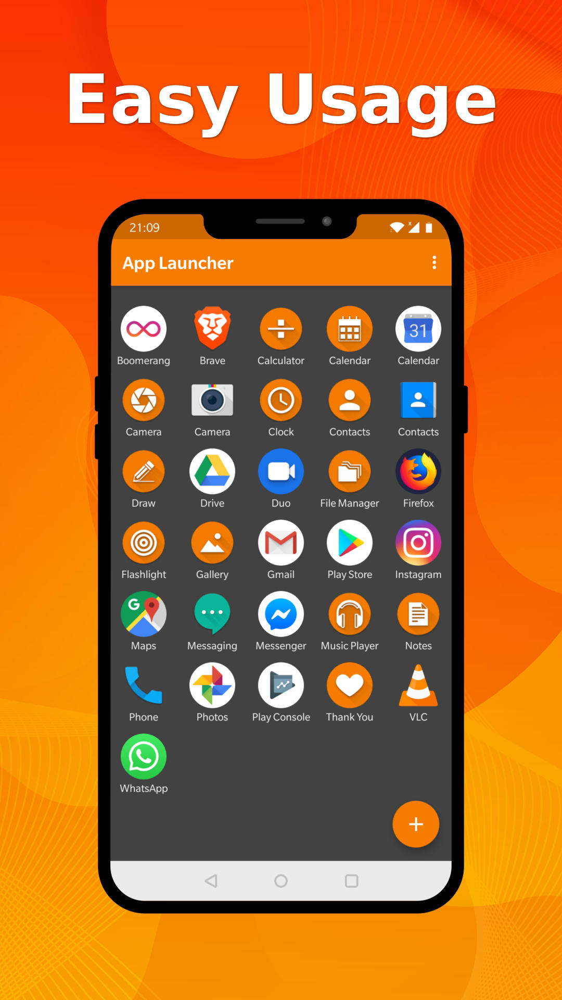
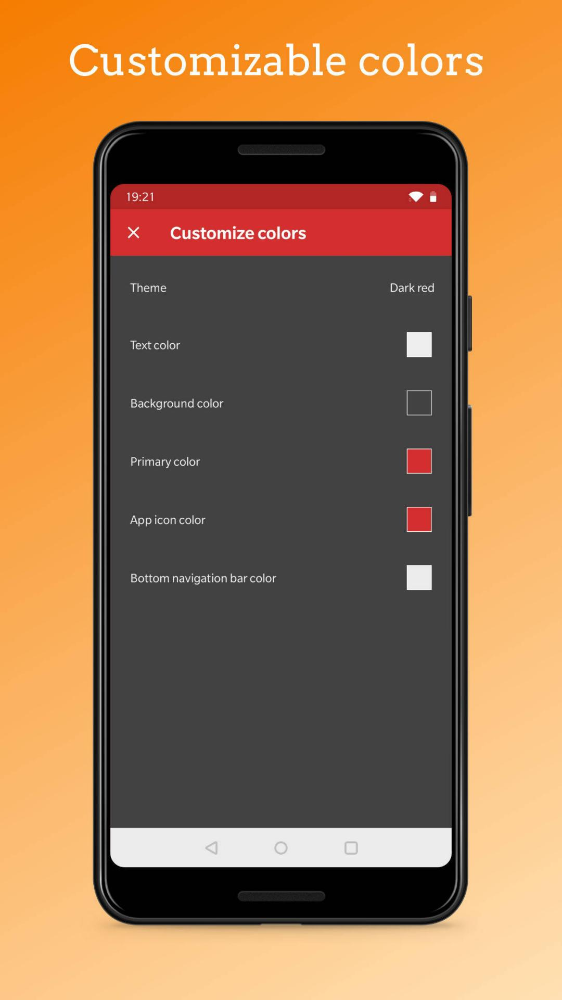

# Simple App Launcher

You can easily add any app launcher, so you won't ever again have to swipe through useless apps to find the one you need. You can also rename the launchers as you wish. It is not a real launcher replacing your home screen, just a holder for your favourite apps.

Contains no ads or unnecessary permissions. It is fully opensource, provides customizable colors.

This app is just one piece of a bigger series of apps. You can find the rest of them at https://www.simplemobiletools.com

 

